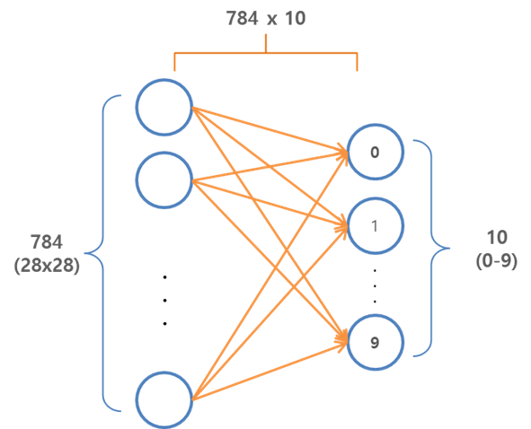
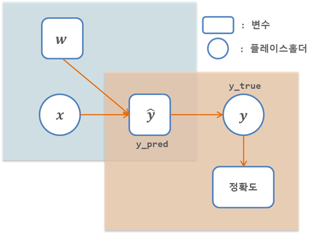

# Chap02 - 텐서플로 설치에서 실행까지

 

## 2.1 텐서플로 설치

텐서플로 설치에 대한 자세한 내용는 https://www.tensorflow.org/install/ 에서 각 운영체제별로 설치할 수 있게 안내되어 있다. 

```bash
# TensorFlow CPU 
$ pip install tensorflow

# TensorFlow GPU
$ pip install tensorflow-gpu
```

 

## 2.2 Hello World

TensorFlow의 첫 번째 예제인 `Hello`와 `World!`라는 단어를 결합해 `Hello World!`라는 문구를 출력하는 프로그램이다. 


```python
import tensorflow as tf

# TensorFlow 버전 확인
print(tf.__version__)
```

    1.8.0


```python
# hello_world.py

h = tf.constant("Hello")  # 상수
w = tf.constant(" World!")
hw = h + w

with tf.Session() as sess:
    ans = sess.run(hw)
    
print(ans)
```

    b'Hello World!'


다음은 `str` 타입의 `phw = ph + pw`와 `tf.constant` 타입의 `hw`를 비교해보자.


```python
ph = "Hello"
pw = " World!"
phw = ph + pw

print('str: {}, type: {}'.format(phw, type(phw)))
print('tensorflow: {}, type: {}'.format(hw, type(hw)))
```

    str: Hello World!, type: <class 'str'>
    tensorflow: Tensor("add:0", shape=(), dtype=string), type: <class 'tensorflow.python.framework.ops.Tensor'>


3장에서 텐서플로의 연산 그래프 모델을 자세히 알아 볼 수 있다.

텐서플로의 연산 그래프와 관련된 중요한 개념은, 

1. 먼저 어떠한 연산을 할지 정의해둔 후
2. 외부 메커니즘을 통해서 그 연산을 실행 시킨다.

위의 코드에서 `hw = h + w`에서 텐서플로 코드는 `h`와 `w`의 합인 `Hello World!`를 출력하는 것이 아닌 나중에 실행될 합 연산을 **연산 그래프(computation graph)** 에 추가한다.

그런 다음, `Session` 객체는 텐서플로 연산 메커니즘에 대한 인터페이스 역할을 하며, `ans = sess.run(hw)`에서 `hw = h + w`연산을 수행한다. 따라서, `print(ans)`를 하면 `Hllo World!`를 출력한다.

 

## 2.3 MNIST

위에서 간단한 텐서플로 예제를 살펴 보았다. 이번에는 필기체 숫자로 이루어진 'MNIST 데이터베이스'를 이용해 필기체 숫자 분류를 해보자. MNIST는 미국 인구조사국으 지기원들이 쓴 숫자와 고등학생들이 쓴 숫자로 만든 미국 국립표준기술연구소(NIST)의 데이터베이스를 다시 섞어 만든 필기체 숫자 이미지 데이터베이스이다. 

MNIST 데이터는 딥러닝 예제에서 빠지지 않고 등장하는 데이터라고 할 수 있다. 


 

## 2.4 소프트맥스 회귀 - Softmax Regression

이번에 구현할 MNIST 분류 예제에서는 **[소프트맥스 회귀(softamx regression)](https://houxianxu.github.io/2015/04/23/logistic-softmax-regression/)** 을 이용하여 구현한다. 텐서플로를 공부하는 것이기 때문에 자세한 설명은 생략한다. [softmax regression](http://ufldl.stanford.edu/tutorial/supervised/SoftmaxRegression/)은 binary classification에서 사용되는 [logistic regression](https://ratsgo.github.io/machine%20learning/2017/04/02/logistic/)을 multinomial classification로 확장한 개념이라 할 수 있다. 자세한 내용은 해당 용어의 링크를 참고하면 된다.

$$
h(x^{(i)}) = \frac{e^{w_{y_j}^Tx^{(i)}}} {\sum_{j = 1}^k e^{w_j^Tx^{(i)}}}
$$


```python
# softmax.py
# import tensorflow as tf
from tensorflow.examples.tutorials.mnist import input_data

# 상수 설정
DATA_DIR = '../data'
NUM_STEPS = 1000
MINIBATCH_SIZE = 100

# MNIST 데이터 불러오기
data = input_data.read_data_sets(DATA_DIR, one_hot=True)
```

    Extracting ../data\train-images-idx3-ubyte.gz
    Extracting ../data\train-labels-idx1-ubyte.gz
    Extracting ../data\t10k-images-idx3-ubyte.gz
    Extracting ../data\t10k-labels-idx1-ubyte.gz


```python
#########
# 모델링 
#########
x = tf.placeholder(tf.float32, [None, 784])
W = tf.Variable(tf.zeros([784, 10]))
# b = tf.Variable(tf.random_uniform([10], -1., 1.))

# y_pred = tf.add(tf.matmul(x ,W), b)
y_pred = tf.matmul(x, W)
y_true = tf.placeholder(tf.float32, [None, 10])

# Cost(Loss) Function
cross_entropy = tf.reduce_mean(
                    tf.nn.softmax_cross_entropy_with_logits_v2(logits=y_pred, labels=y_true))

# Gradient Step(Optimze)
gd_step = tf.train.GradientDescentOptimizer(learning_rate=0.5).minimize(cross_entropy)

correct_mask = tf.equal(tf.argmax(y_pred, 1), tf.argmax(y_true, 1))
accuracy = tf.reduce_mean(tf.cast(correct_mask, tf.float32))
```


```python
with tf.Session() as sess:
    # 학습
    sess.run(tf.global_variables_initializer())
    
    for step in range(NUM_STEPS):
        batch_xs, batch_ys = data.train.next_batch(MINIBATCH_SIZE)
        sess.run(gd_step, feed_dict={x: batch_xs, y_true: batch_ys})
        
        if(step + 1) % 100 == 0:
            print(step+1, '|', sess.run(cross_entropy, feed_dict={x: batch_xs, y_true: batch_ys}))
        
    # 테스트
    ans = sess.run(accuracy, feed_dict={x: data.test.images,
                                       y_true: data.test.labels})
    
print("Accuracy: {:.2f}%".format(ans*100))
```

    100 | 0.42410415
    200 | 0.29747245
    300 | 0.25943187
    400 | 0.280245
    500 | 0.27326566
    600 | 0.23633882
    700 | 0.32467315
    800 | 0.26527068
    900 | 0.45479637
    1000 | 0.42248863
    Accuracy: 91.73%


### 소스코드 분석

위의 softmax.py 코드를 한 블록씩 분석 해보자.

#### 1) TensorFlow import 및 MNIST example utils import

```python
import tensorflow as tf
from tensorflow.examples.tutorials.mnist import input_data
```

텐서플로에서 MNIST 데이터를 바로 불러올 수 있도록 내장 유틸리티를 제공한다.


#### 2) 프로그램에서 사용하는 상수 정의

```python
DATA_DIR = '../data'
NUM_STEPS = 1000
MINIBATCH_SIZE = 100
```


#### 3) MNIST 데이터 읽어오기

```python
data = input_data.read_data_sets(DATA_DIR, one_hot=True)
```

MNIST 데이터를 읽어 들이는 `read_data_sets()`메소드는 데이터를 내려받아 로컬에 저장하여 프로그램에서 사용할 수 있도록 해준다. 하지만 현재(2018.05.30 기준) TensorFlow 1.8 버전에서는 위의 코드를 실행하면 다음과 같은 에러 문구가 나타난다.

```
read_data_sets (from tensorflow.contrib.learn.python.learn.datasets.mnist) is deprecated and will be removed in a future version.
Instructions for updating:
Please use alternatives such as official/mnist/dataset.py from tensorflow/models.
```

이러한 Warning을 나타나지 않게 하기위해서 [`tf.keras.datasets.mnist.load_data()`](https://www.tensorflow.org/api_docs/python/tf/keras/datasets/mnist/load_data)를 이용할 수 있다. 이것을 이용한 코드는 나중에 설명하도록 하겠다.


#### 4) 모델 설정 단계

이번 MNIST 분류 예제에서는 아래의 그림처럼 입력(Input)과 출력(Output)사이의 가중치($784 \times 10$)를 학습하는 모델이다.



<br />

```python
x = tf.placeholder(tf.float32, [None, 784])
W = tf.Variable(tf.zeros([784, 10]))
```

- `tf.Variable()`은 변수이며 연산 과정에서 값이 변경된다. 
- `tf.placeholder()`은 연산 그래프가 실행될 때 제공되어야 하는 값이라 할 수 있다. 예제에서는 MNIST 이미지는 입력 데이터(`x`)이며, 연산 그래프가 실행될때 제공된다. 
- `x = tf.placeholder(tf.float32, [None, 784])`에서 `[None, 784]`는 한 이미지의 사이즈가 784(28 * 28)이며 몇개의 이미지 만큼을 입력으로 받을지는 지정하지 않은 것이다. 여기에 입력될 이미지의 개수는 위에서 정의한 `MINIBATCH_SIZE = 100` 인 만큼 입력받게 된다.


```python
y_pred = tf.matmul(x ,W)
y_true = tf.placeholder(tf.float32, [None, 10])
```

- `y_pred`는 모델이 출력한 결과값 즉, 예측값
- `y_true`는 이미지의 실제 레이블(정답) 값


#### 5) 손실함수(Loss Function)

```python
cross_entropy = tf.reduce_mean(
                    tf.nn.softmax_cross_entropy_with_logits_v2(logits=y_pred, labels=y_true))

gd_step = tf.train.GradientDescentOptimizer(learning_rate=0.5).minimize(cross_entropy)
```

손실함수로는 교차엔트로피를 사용한다.

```python
gd_step = tf.train.GradientDescentOptimizer(learning_rate=0.5).minimize(cross_entropy)
```

손실함수를 최소화 하는 방법으로는 경사하강법(Gradient Descent)을 사용한다.


#### 6) 정확도 테스트

```python
correct_mask = tf.equal(tf.argmax(y_pred, 1), tf.argmax(y_true, 1))
accuracy = tf.reduce_mean(tf.cast(correct_mask, tf.float32))
```

정확하게 분류된 테스트 데이터의 비율을 사용한다.


#### 7) 세션을 만들기

위에서 정의한 연산 그래프를 사용하려면 세션을 만들어야 한다. 나머지 과정인 학습 및 정확도 테스트는 모두 세션 내에서 실행된다.

```python
with tf.Session() as sess:
    # 학습
    # TODO: 
    
    # 테스트
    # TODO:
```


#### 8) 모든 변수 초기화

먼저 모든 변수를 초기화해야 한다. 초기화 과정은 학습과정에 영향을 주게 되는데 이러한 영향을 많이 받는 모델들이 있는데 이 부분에 대해서는 나중에 자세히 다루게 된다.

```python
sess.run(tf.global_variables_initializer())
```


#### 9) 학습 단계

경사 하강법을 이용해 학습이 이루어 지는 부분이다. 여기에서 `for`문을 `NUM_STEPS = 1000`만큼 반복하면서 학습이 이루어 진다. `sess.run()`의 인수로 `feed_dict`를 사용하는데, 이것은 위에서 정의한 `tf.placeholder`인 `x`에 `MINIBATCH_SIZE=100` 개수만큼의 `batch_xs` (train 데이터에서 임의로 추출한 100개의 이미지)를 `x`인 `tf.placeholder`에 값을 주는(feed) 것이다.

```python
for step in range(NUM_STEPS):
    batch_xs, batch_ys = data.train.next_batch(MINIBATCH_SIZE)
    sess.run(gd_step, feed_dict={x: batch_xs, y_true: batch_ys})
```


#### 10) 테스트

학습을 마친 모델을 평가하기 위한 정확도를 계산한다. 

```python
ans = sess.run(accuracy, feed_dict={x: data.test.images,
                                    y_true: data.test.labels})
```

위의 과정을 그래프로 그리면 다음과 같다.




 


## 2.5 `tf.data.Dataset`을 이용한 MNIST 데이터 불러오기

위에서도 말했듯이, 텐서플로 1.8 버전에서

```python
from tensorflow.examples.tutorials.mnist import input_data
data = input_data.read_data_sets(DATA_DIR, one_hot=True)
```
를 실행하면 다음과 같은 경고 문구가 나오게 된다. 

```
read_data_sets (from tensorflow.contrib.learn.python.learn.datasets.mnist) is deprecated and will be removed in a future version.
Instructions for updating:
Please use alternatives such as official/mnist/dataset.py from tensorflow/models.
```

따라서, 이러한 경고문구가 나오지 않도록 `tf.keras.datasets.mnist.load_data()` 와 `tf.data.Dataset`을 이용하여 모델의 입력값에 맞게끔 데이터를 만들어 보도록 하자. 아래의 코드들은 tensorflow.org의 [Datasets Quick Start](https://www.tensorflow.org/get_started/datasets_quickstart)를 참고하여 작성했다. 자세한 내용은 해당링크를 참고하면 된다.


```python
def mnist_load():
    (train_x, train_y), (test_x, test_y) = tf.keras.datasets.mnist.load_data()

    # Train set
    # Image
    train_x = train_x.reshape([train_x.shape[0], -1])
    train_x = train_x.astype('float32') / 255
    # Label
    train_y = tf.keras.utils.to_categorical(train_y, num_classes=10)

    # Test set
    # Image
    test_x = test_x.reshape([test_x.shape[0], -1])
    test_x = test_x.astype('float32') / 255
    # Label
    test_y = tf.keras.utils.to_categorical(test_y, num_classes=10)
    
    return (train_x, train_y), (test_x, test_y)
```


```python
(train_x, train_y), (test_x, test_y) = mnist_load()

buffer_size = train_x.shape[0] + test_x.shape[0]

dataset = tf.data.Dataset.from_tensor_slices(({"image": train_x}, train_y))
dataset = dataset.shuffle(buffer_size).repeat().batch(MINIBATCH_SIZE)
iterator = dataset.make_one_shot_iterator()
next_batch = iterator.get_next()
```


```python
x = tf.placeholder(tf.float32, [None, 784])
W = tf.Variable(tf.zeros([784, 10]))

y_pred = tf.matmul(x ,W)
y_true = tf.placeholder(tf.float32, [None, 10])

# Cost(Loss) Function
cross_entropy = tf.reduce_mean(
                    tf.nn.softmax_cross_entropy_with_logits_v2(logits=y_pred, labels=y_true))

# Gradient Step(Optimze)
gd_step = tf.train.GradientDescentOptimizer(learning_rate=0.5).minimize(cross_entropy)

correct_mask = tf.equal(tf.argmax(y_pred, 1), tf.argmax(y_true, 1))
accuracy = tf.reduce_mean(tf.cast(correct_mask, tf.float32))
```


```python
%%time
with tf.Session() as sess:
    # 학습
    sess.run(tf.global_variables_initializer())
    
    for step in range(NUM_STEPS):
        batch_xs, batch_ys = sess.run(next_batch)
        sess.run(gd_step, feed_dict={x: batch_xs['image'], y_true: batch_ys})
        
        if(step + 1) % 100 == 0:
            print(step+1, '|', sess.run(cross_entropy, feed_dict={x: batch_xs['image'], y_true: batch_ys}))
        
    # 테스트
    ans = sess.run(accuracy, feed_dict={x: test_x,
                                       y_true: test_y})
    
print("Accuracy: {:.2f}%".format(ans*100))
```

    100 | 0.31033343
    200 | 0.26896414
    300 | 0.25220472
    400 | 0.2761525
    500 | 0.19281076
    600 | 0.14138816
    700 | 0.25681496
    800 | 0.22324719
    900 | 0.27169204
    1000 | 0.19857246
    Accuracy: 91.79%
    Wall time: 16.1 s

