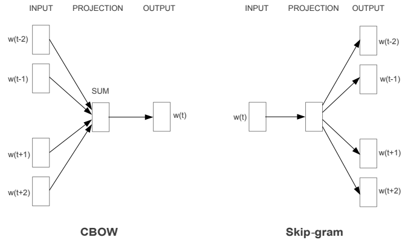
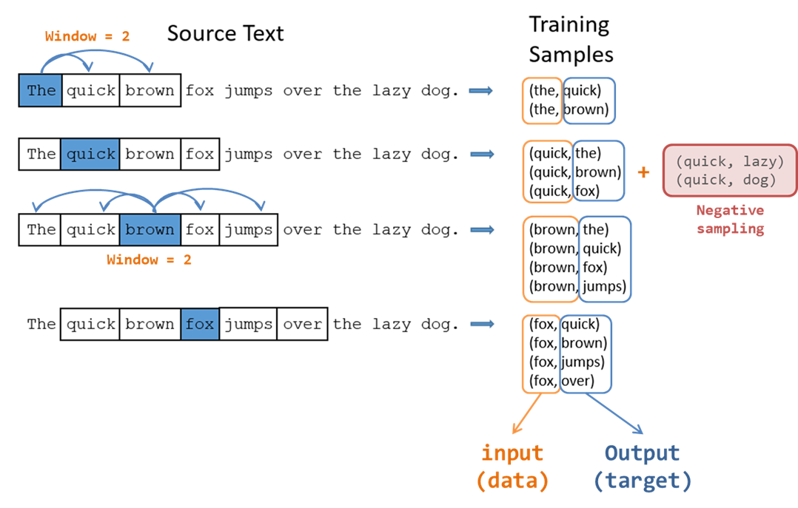
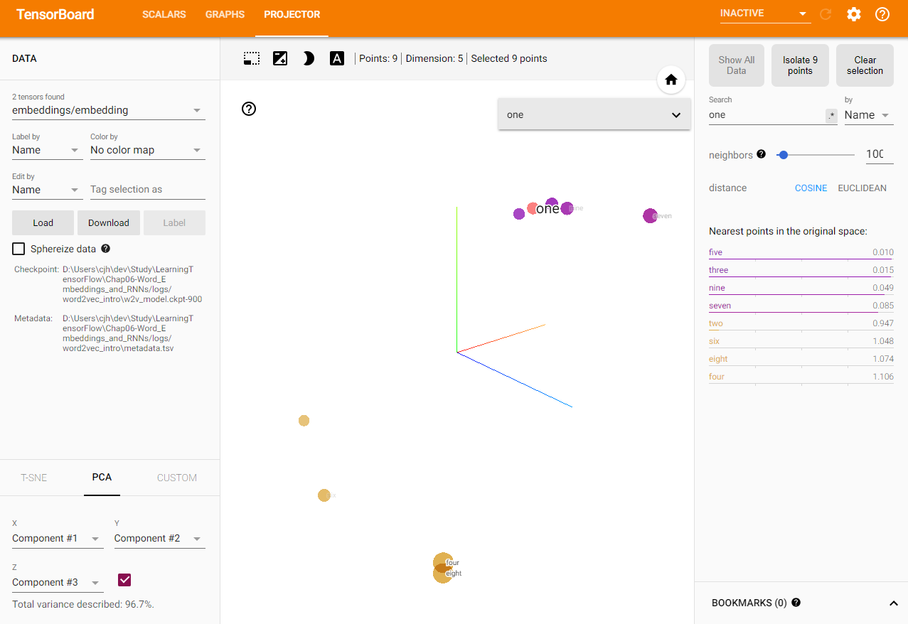
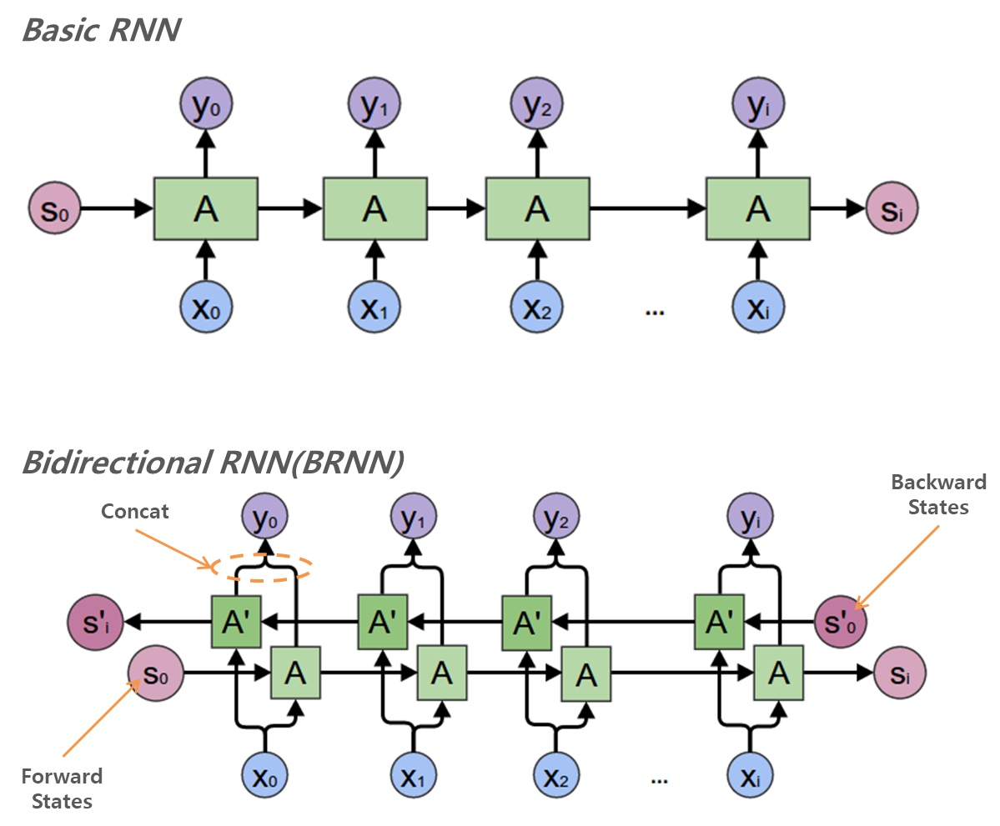
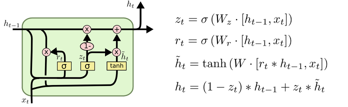

# Chap06 - 텍스트 2: 단어 벡터, 고급 RNN, 임베딩 시각화

> [5장](http://excelsior-cjh.tistory.com/154)에서 살펴본 텍스트 시퀀스를 좀 더 깊이 알아보며, **word2vec**이라는 비지도학습 방법을 사용하여 단어 벡터를 학습하는 방법과 텐서보드를 사용해서 임베딩을 시각화 하는 방법에 대해 알아보자. 그리고 RNN의 업그레이드 버전인 **GRU**에 대해서 알아보자.

 

## 6.1 단어 임베딩 소개

[5.3.2](http://excelsior-cjh.tistory.com/154)에서 텐서플로(TensorFlow)를 이용해 텍스트 시퀀스를 다루는 방법을 알아 보았다. 단어 ID를 저차원의 Dense vector로의 매핑을 통해 단어 벡터를 학습시켰다. 이러한 처리가 필요한 이유는 RNN의 입력으로 넣어 주기 위해서였다.

> TensorFlow is an open source software library for high performance numerical computation.

위의 문장을 [5.3.2](http://excelsior-cjh.tistory.com/154)에서처럼, 각 단어를 ID로 표현 한다면 'tensorflow'는 정수 2049에, 'source'라는 단어는 17, 'performance'는 0으로 매핑할 수 있다.

하지만, 이러한 방법은 몇 가지 문제점이 있다. 

- 단어의 의미를 잃어버리게 되고, 단어 사이의 의미론적 근접성(semantic proximity)과 관련 정보를 놓치게 된다. 예를 들어, 위의 문장에서 'high'와 'software'는 서로 관련이 없지만, 이러한 정보는 반영되지 않는다.
- 단어의 수가 엄청 많을 경우 단어당 ID개수 또한 많아지게 되므로 단어의 벡터 표현이 희소(sparse)해져 학습이 어려워진다.

이러한 문제를 해결하기 위한 방법 중 하나는 비지도학습(Unsupervised Learning)인 word2vec을 이용하는 것이다. 이 방법의 핵심은 **분포 가설(Distributional Hypothesis)**이며, 언어학자 존 루퍼트 퍼스(John Rupert Firth)가 한 유명한 말로 설명할 수 있다.

> "You shall know a word by the company it keeps."- "단어는 포함된 문맥 속에서 이해할 수 있다."

즉, 비슷한 맥락에서 함께 나타나는 경향이 있는 단어들은 비슷한 의미를 가지는 경향이 있다.

 

## 6.2 word2vec

**word2vec**은 2013년에 [Distributed Representations of Words and Phrases and their Compositionality](https://arxiv.org/pdf/1310.4546.pdf)(Mikolov et al.) 논문에서 등장한 비지도학습의 원드 임베딩 방법이다. word2vec에는 아래의 그림과 같이 두가지 구조(architecture)가 있는데, 이번 구현은 **skip-gram**을 이용해 단어의 문맥을 예측하는 모델을 학습한다. word2vec의 이론에 대해 자세한 설명은 [ratsgo's blog](https://ratsgo.github.io/from%20frequency%20to%20semantics/2017/03/30/word2vec/)를 참고하면 된다.



word2vec의 **skip-gram** 모델은 아래의 그림에서 볼 수 있듯이, 중심단어에서 윈도우 크기(Window size)만큼의 주변 단어들을 예측하는 모델이다.



 

word2vec 모델은 학습시간을 줄이기 위해 트릭을 쓰는데, 바로 **네거티브 샘플링(negative sampling)** 이다. 네거티브 샘플링은 위의 그림에서 처럼 'Training Sample'과 같은 단어 쌍들에 포함되어 있지 않는 **가짜** 단어 쌍들을 만들어 낸다. 즉, 지정한 윈도우 사이즈 내에서 포함되지 않는 단어들을 포함시켜 단어 쌍들을 만들어 내는것이다. 예를 들어 위의 그림에서 두번째 줄에서 윈도우 사이즈 내에 포함되지 않는 `lazy`라는 단어를 뽑아 `(quick, lazy)`라는 단어쌍을 만드는 것이다.

이렇게 '진짜'와 '가짜' 단어를 섞어 (학습 데이터, 타겟) 데이터를 만들고 이것을 구분할 수 있는 이진 분류기(binary classifier)를 학습시킨다. 이 분류기에서 학습된 가중치($\mathrm{W}$)벡터가 바로 **워드 임베딩**이다. (아래 그림 출처: [Lil'Log](https://lilianweng.github.io/lil-log/2017/10/15/learning-word-embedding.html))


 

### 6.2.1 Skip-Gram 구현

텐서플로(TensorFlow)를 이용해 기본적인 word2vec 모델을 구현해보자. 여기서는 [5.3.1 텍스트 시퀀스](http://excelsior-cjh.tistory.com/154)에서와 마찬가지로 '홀수'와 '짝수'로 이루어진 두 종류의 '문장'인 가상의 데이터를 생성해 word2vec을 구현해 보도록 하겠다. 기회가 된다면, 영어 및 한글의 실제 데이터를 가지고 word2vec을 구현하는 것을 추후에 포스팅하도록 하겠다. 


```python
import os
import math
import numpy as np
import tensorflow as tf
from tensorflow.contrib.tensorboard.plugins import projector
from pprint import pprint
```


```python
####################
# Hyper Parameters #
####################
batch_size = 64
embedding_dimension = 5
negative_samples = 8
ABS_PATH = os.path.dirname(os.path.abspath('logs'))
LOG_DIR = ABS_PATH+'/logs/word2vec_intro'


digit_to_word_map = {1: "One", 2: "Two", 3: "Three", 4: "Four", 5: "Five",
                     6: "Six", 7: "Seven", 8: "Eight", 9: "Nine"}
sentences = []

# 홀수 시퀀스/짝수 시퀀스 두 종류의 문장을 생성
for i in range(10000):
    rand_odd_ints = np.random.choice(range(1, 10, 2), size=3)
    sentences.append(" ".join([digit_to_word_map[r] for r in rand_odd_ints]))
    rand_even_ints = np.random.choice(range(2, 10, 2), size=3)
    sentences.append(" ".join([digit_to_word_map[r] for r in rand_even_ints]))

# 생성된 문장 확인
pprint(sentences[0: 10])
```

    ['Nine Three Three',
     'Two Six Four',
     'Nine One Nine',
     'Two Six Two',
     'Five Seven Five',
     'Two Two Eight',
     'Seven Five Five',
     'Eight Two Six',
     'One Seven Seven',
     'Two Six Four']


```python
# 단어를 인덱스에 매핑
word2index_map = {}
index = 0
for sent in sentences:
    for word in sent.lower().split():
        if word not in word2index_map:
            word2index_map[word] = index
            index+=1

index2word_map = {index: word for word, index in word2index_map.items()}
vocabulary_size = len(index2word_map)

print('word2index_map >>>', word2index_map)
print('index2word_map >>>', index2word_map)
print('vocabulary_size >>>', vocabulary_size)
```

    word2index_map >>> {'nine': 0, 'three': 1, 'two': 2, 'six': 3, 'four': 4, 'one': 5, 'five': 6, 'seven': 7, 'eight': 8}
    index2word_map >>> {0: 'nine', 1: 'three', 2: 'two', 3: 'six', 4: 'four', 5: 'one', 6: 'five', 7: 'seven', 8: 'eight'}
    vocabulary_size >>> 9

 

이제 필요한 데이터를 생성했으니, word2vec skip-gram 모델을 만들어보자. 이번 구현 예제에서는 윈도우 사이즈를 1로 설정했다.


```python
# Skip-Gram 쌍(pair) 생성 (Window=1)
skip_gram_pairs = []
for sent in sentences:
    tokenized_sent = sent.lower().split()
    for i in range(1, len(tokenized_sent)-1):
        word_context_pair = [[word2index_map[tokenized_sent[i-1]],
                              word2index_map[tokenized_sent[i+1]]],
                             word2index_map[tokenized_sent[i]]]
        skip_gram_pairs.append([word_context_pair[1],
                                word_context_pair[0][0]])
        skip_gram_pairs.append([word_context_pair[1],
                                word_context_pair[0][1]])
```


```python
print(skip_gram_pairs[0:10])
```

    [[1, 0], [1, 1], [3, 2], [3, 4], [5, 0], [5, 0], [3, 2], [3, 2], [7, 6], [7, 6]]

 

위의 `skip_gram_pairs`는 리스트안에 리스트 형태로 `(데이터, 타겟)` 형태로 skip-gram 쌍을 구현한 것을 확인할 수 있다. 이것을 `batch_size`만큼 가져오는 것을 아래와 같이 `get_skipgram_batch`함수로 구현하였다.


```python
def get_skipgram_batch(batch_size):
    instance_indices = list(range(len(skip_gram_pairs)))
    np.random.shuffle(instance_indices)
    batch = instance_indices[:batch_size]
    x = [skip_gram_pairs[i][0] for i in batch]
    y = [[skip_gram_pairs[i][1]] for i in batch]
    return x, y
```


```python
# mini-batch example
x_batch, y_batch = get_skipgram_batch(8)
print('x_batch :', x_batch)
print([index2word_map[word] for word in x_batch])
print('-'*30)
print('y_batch :', y_batch)
print([index2word_map[word[0]] for word in y_batch])
```

    x_batch : [0, 7, 1, 1, 8, 8, 2, 1]
    ['nine', 'seven', 'three', 'three', 'eight', 'eight', 'two', 'three']
    ------------------------------
    y_batch : [[5], [5], [6], [1], [8], [2], [4], [0]]
    ['one', 'one', 'five', 'three', 'eight', 'two', 'four', 'nine']

 

이제 입력과 타깃(레이블)에 사용할 텐서플로의 플레이스홀더를 생성해준다.


```python
# 입력 데이터와 레이블
train_inputs = tf.placeholder(tf.int32, shape=[batch_size])
train_labels = tf.placeholder(tf.int32, shape=[batch_size, 1])
```

 

### 6.2.2. 텐서플로에서의 임베딩

텐서플로의 [`tf.nn.embedding_lookup()`](https://www.tensorflow.org/api_docs/python/tf/nn/embedding_lookup) 함수를 사용해 임베딩한다. 워드 임베딩은 단어를 벡터로 매핑하는 룩업 테이블(look-up table)로 볼 수 있다.


```python
with tf.name_scope('embeddings'):
    embeddings = tf.Variable(
            tf.random_uniform([vocabulary_size, embedding_dimension],
                              -1.0, 1.0), name='embedding')
    # This is essentialy a lookup table
    embed = tf.nn.embedding_lookup(embeddings, train_inputs)
```

 

### 6.2.3 Noise-Contrastive Estimation(NCE) 손실함수

위에서 skip-gram 모델을 만들 때, '진짜' (단어, 타겟)쌍 뿐만 아니라 '가짜' 노이즈(noise) 쌍도 같이 만들어줘서 학습할때 사용한다고 했다. 따라서, 진짜와 노이즈를 구분할 수 있도록 학습을 시켜야 한다. 

텐서플로에서는 이러한 학습을 할 수 있도록 Noise-Constratrive Estimation(NCE)라는 손실함수를 제공한다. [`tf.nn.nce_loss()`](https://www.tensorflow.org/api_docs/python/tf/nn/nce_loss)를 사용하면 세션 스코프 내에서 손실을 계산할 때 노이즈(가짜) 표본을 자동으로 만들어 준다. NCE의 식은 다음과 같다.

$$
\mathcal{L}_\theta = - [ \log \frac{\exp({v'_w}^{\top}{v_{w_I}})}{\exp({v'_w}^{\top}{v_{w_I}}) + Nq(\tilde{w})} +  \sum_{\substack{i=1 \\ \tilde{w}_i \sim Q}}^N \log \frac{Nq(\tilde{w}_i)}{\exp({v'_w}^{\top}{v_{w_I}}) + Nq(\tilde{w}_i)}]
$$


```python
# Create variables for the NCE loss
nce_weights = tf.Variable(
        tf.truncated_normal([vocabulary_size, embedding_dimension],
                            stddev=1.0 / math.sqrt(embedding_dimension)))
nce_biases = tf.Variable(tf.zeros([vocabulary_size]))

# NCE loss
loss = tf.reduce_mean(
    tf.nn.nce_loss(weights=nce_weights, biases=nce_biases, inputs=embed, labels=train_labels,
                   num_sampled=negative_samples, num_classes=vocabulary_size))
tf.summary.scalar('NCE_loss', loss)
```


    <tf.Tensor 'NCE_loss:0' shape=() dtype=string>


### 6.2.4 학습률 감소

경사 하강법(Gradient Descent) 최적화는 손실함수를 최소화하는 방향으로 조금씩 이동하면서 가중치를 조정한다. `learning rate`인 $\eta$는 하이퍼파라미터로서 이동하는 크기를 결정하는 매개변수이다. **학습률 감소(learning rate decay)** 기법은 학습이 진행될수록 해당 모델의 손실값이 최저 지점에 수렴하게 되므로 학습률의 크기를 점차 감소시켜, 경사 하강법 최적화 프로세스가 **안정화** 되도록한다.

[`tf.train.exponential_decay()`](https://www.tensorflow.org/api_docs/python/tf/train/exponential_decay)은 학습률을 지수적으로 감소시킨다. 이를 식으로 나타내면 다음과 같다.

$$
\eta \leftarrow \eta e^{-kt}
$$

위의 식에서 $\eta$는 학습률, $t$는 decay_step, $k$는 decay_rate이다. 아래 코드는 1,000 단계마다 학습률을 감소시켜주는 코드이다.


```python
# learning_rate decay
global_step = tf.Variable(0, trainable=False)
learning_rate = tf.train.exponential_decay(learning_rate=0.1,
                                           global_step=global_step,
                                           decay_steps=1000,
                                           decay_rate=0.95,
                                           staircase=True)
train_step = tf.train.GradientDescentOptimizer(learning_rate).minimize(loss)
```

 

### 6.2.5 텐서보드를 사용하여 학습하고 시각화하기

`tf.Session()`내에서 그래프를 학습할 때 텐서보드에 시각화 해줄 부분을 코드로 작성하면 시각화가 가능하다. 2016년 하반기부터 텐서보드에서 고차원 데이터의 임베딩을 시각화하는 기능을 제공하기 시작했다. 텐서보드에 임베딩을 시각화 해주기 위해서는 다음과 같이 해주면 된다.

1. `tsv` 형식의 메타데이터 파일을 생성한다. 이 파일은 임베딩 벡터를 연관 레이블이나 이미지와 연결한다. 이번 word2vec 예제에서는 각 임베딩 벡터는 해당 단어와 매핑되어 있다.
2. 텐서보드에 임베딩 변수를 지정하고 이 변수를 메타데이터 파일에 연결한다.
3. `tf.Session()`을 닫기 전에 워드 임베딩 벡터를 단위 길이로 정규화 해준다.


```python
# 모든 요약 연산을 병합
merged = tf.summary.merge_all()

with tf.Session() as sess:
    train_writer = tf.summary.FileWriter(LOG_DIR,
                                         graph=tf.get_default_graph())
    saver = tf.train.Saver()
    
    with open(os.path.join(LOG_DIR, 'metadata.tsv'), "w") as metadata:
        metadata.write('Name\tClass\n')
        for k, v in index2word_map.items():
            metadata.write('%s\t%d\n' % (v, k))
            
    config = projector.ProjectorConfig()
    embedding = config.embeddings.add()
    embedding.tensor_name = embeddings.name
    # 임베딩을 메타데이터 파일과 연결
    embedding.metadata_path = os.path.join(LOG_DIR, 'metadata.tsv')
    projector.visualize_embeddings(train_writer, config)
    
    tf.global_variables_initializer().run()
    
    for step in range(1000):
        x_batch, y_batch = get_skipgram_batch(batch_size)
        summary, _ = sess.run([merged, train_step], 
                              feed_dict={train_inputs: x_batch,
                                         train_labels: y_batch})
        train_writer.add_summary(summary, step)
        
        if step % 100 == 0:
            saver.save(sess, os.path.join(LOG_DIR, 'w2v_model.ckpt'), step)
            loss_value = sess.run(loss, feed_dict={train_inputs: x_batch,
                                                   train_labels: y_batch})
            print("Loss at %d: %.5f" % (step, loss_value))
            
    # 사용 전 임베딩 정규화
    norm = tf.sqrt(tf.reduce_sum(tf.square(embeddings), 1, keepdims=True))
    normalized_embeddings = embeddings / norm
    normalized_embeddings_matrix = sess.run(normalized_embeddings)
```

    Loss at 0: 7.45672
    Loss at 100: 3.08444
    Loss at 200: 2.69164
    Loss at 300: 2.58931
    Loss at 400: 2.59511
    Loss at 500: 2.52665
    Loss at 600: 2.55304
    Loss at 700: 2.51700
    Loss at 800: 2.54071
    Loss at 900: 2.41336

 

### 6.2.6 임베딩 확인해보기

학습이 끝났으니, 단어벡터들을 확인해 보도록 하자. 아래의 코드는 단어 `one`을 선택해 `one`과 코사인 유사도가 가까운 순으로 내림차순하여 정렬한 것이다.


```python
ref_word = normalized_embeddings_matrix[word2index_map['one']]

cosine_dists = np.dot(normalized_embeddings_matrix, ref_word)
ff = np.argsort(cosine_dists)[::-1][1:10]
for f in ff:
    print('word: %s\tsim: %.5f' % (index2word_map[f], cosine_dists[f]))
```

    word: nine	sim: 0.96554
    word: three	sim: 0.92132
    word: five	sim: 0.84002
    word: seven	sim: 0.72310
    word: six	sim: 0.11736
    word: eight	sim: 0.00323
    word: two	sim: -0.10100
    word: four	sim: -0.10465

 

위의 결과에서 확인할 수 있듯이, `five, seven, ninge, three`와 같이 홀수를 나타내는 단어들이 `one`과 가깝고 `eight, two, four, six`의 짝수를 나타내는 단어들은 `one`과 가깝지 않음을 알 수 있다.

이번에는 터미널(또는 cmd 창)에서 아래의 명령어를 통해 텐서보드(TensorBoard)를 실행시키고, **PROJECTOR** 탭에서 임베딩된 단어 벡터를 확인해보자.

```bash
#LOG_DIR = ./logs/word2vec_intro
tensorboard --logdir=LOG_DIR  # logs 디렉터리 경로
```



 

## 6.3 사전 학습된 임베딩과 고급 RNN

위에서 살펴본 word2vec의 워드 임베딩은 텍스트 처리를 위한 유용한 딥러닝 모델이다. 최근 연구에서 주로 사용되는 방법은 word2vec과 같은 방법으로 단어 벡터를 학습한 다음, 이 벡터를 이용해 supervised learning의 classification과 같은 작업을 해준다.

 

### 6.3.1 사전 학습된 워드 임베딩

이번에는 사전 학습된 워드 임베딩을 가져와 RNN의 업그레이드 버전인 GRU(Gated Recurrent Unit) 모델링에 적용해보자. 사전 학습된 워드 임베딩은 **[GloVe](https://nlp.stanford.edu/projects/glove/)**라는 임베딩 방법이며 word2vec과 비슷한 방법이다. 자세한 내용은 [ratsgo's blog](https://ratsgo.github.io/from%20frequency%20to%20semantics/2017/04/09/glove/)를 참고하면 된다. 

학습된 워드 임베딩은 https://nlp.stanford.edu/projects/glove/ 에서 다운로드 받을 수 있으며, 그 중 [glove.840B.300d.zip](http://nlp.stanford.edu/data/glove.840B.300d.zip)를 사용한다. 다운로드를 받은 후 적절한 위치로 옮겨준 뒤 사용하면 된다.


```python
import zipfile
import numpy as np
import tensorflow as tf

####################
# Hyper Parameters #
####################
path_to_glove = '../data/glove.840B.300d.zip'
PRE_TRAINED = True
GLOVE_SIZE = 300
batch_size = 128
embedding_dimension = 64
num_classes = 2
hidden_layer_size = 32
time_steps = 6
```

 

GRU에 사용할 데이터 셋을 만들어 주기 위해 [5.3.1 텍스트 시퀀스](http://excelsior-cjh.tistory.com/154)와 같은 방법으로 홀수/짝수로 구성된 시퀀스 데이터를 만들어 준다.


```python
digit_to_word_map = {1: "One", 2: "Two", 3: "Three", 4: "Four", 5: "Five",
                     6: "Six", 7: "Seven", 8: "Eight", 9: "Nine"}
digit_to_word_map[0] = "PAD_TOKEN"

odd_sentences = []
even_sentences = []
seqlens = []
for i in range(10000):
    rand_seq_len = np.random.choice(range(3, 7))
    seqlens.append(rand_seq_len)
    rand_odd_ints = np.random.choice(range(1, 10, 2), rand_seq_len)
    rand_even_ints = np.random.choice(range(2, 10, 2), rand_seq_len)
    
    # Padding
    if rand_seq_len < 6:
        rand_odd_ints = np.append(rand_odd_ints, [0]*(6-rand_seq_len))
        rand_even_ints = np.append(rand_even_ints, [0]*(6-rand_seq_len))
        
    odd_sentences.append(" ".join([digit_to_word_map[r] for r in rand_odd_ints]))
    even_sentences.append(" ".join([digit_to_word_map[r] for r in rand_even_ints]))
    
data = odd_sentences + even_sentences
# 홀수, 짝수 시퀀스의 seq 길이 저장
seqlens*=2

# 원-핫 인코딩 작업
labels = [1]*10000 + [0]*10000
for i in range(len(labels)):
    label = labels[i]
    one_hot_encoding = [0]*2
    one_hot_encoding[label] = 1
    labels[i] = one_hot_encoding
    
# 단어를 인덱스에 매핑
word2index_map = {}
index = 0
for sent in data:
    for word in sent.split():
        if word not in word2index_map:
            word2index_map[word] = index
            index += 1
# 역방향 매핑
index2word_map = {index: word for word, index in word2index_map.items()}
vocabulary_size = len(index2word_map)

print('word2index_map :', word2index_map)
print('index2word_map :', index2word_map)
```

    word2index_map : {'One': 0, 'Nine': 1, 'Three': 2, 'Seven': 3, 'Five': 4, 'PAD_TOKEN': 5, 'Four': 6, 'Six': 7, 'Two': 8, 'Eight': 9}
    index2word_map : {0: 'One', 1: 'Nine', 2: 'Three', 3: 'Seven', 4: 'Five', 5: 'PAD_TOKEN', 6: 'Four', 7: 'Six', 8: 'Two', 9: 'Eight'}

 

가상의 데이터셋을 만든 다음, 다운로드 받은 GloVe 임베딩에서 위에서 만들어준 가상의 단어(`One ~ Nine`)에 해당하는 GloVe 벡터를 가져온다.


```python
def get_glove(path_to_glove, word2index_map):
    embedding_weights = {}
    count_all_words = 0
    with zipfile.ZipFile(path_to_glove) as z:
        with z.open("glove.840B.300d.txt") as f:
            for line in f:
                vals = line.split()
                word = str(vals[0].decode('utf-8'))
                if word in word2index_map:
                    print(word)
                    count_all_words += 1
                    coefs = np.asarray(vals[1:], dtype='float32')
                    coefs /= np.linalg.norm(coefs)
                    embedding_weights[word] = coefs
                    
                if count_all_words == vocabulary_size-1:
                    break
                    
    return embedding_weights
```


```python
word2embedding_dict = get_glove(path_to_glove, word2index_map)
print(word2embedding_dict['One'].shape)
```

    One
    Two
    Three
    Four
    Five
    Six
    Seven
    Nine
    Eight
    (300,)

 

이제 이 벡터들이 텐서플로에서 사용할 수 있도록 형태를 변환해줘야 한다. 


```python
embedding_matrix = np.zeros((vocabulary_size, GLOVE_SIZE))

for word, index in word2index_map.items():
    if not word == "PAD_TOKEN":
        word_embedding = word2embedding_dict[word]
        embedding_matrix[index, :] = word_embedding
        
print('embedding_matrix.shape :', embedding_matrix.shape)
```

    embedding_matrix.shape : (10, 300)

 

다음으로 홀수 문장과 짝수 문장을 분류하는 모델을 만들기전에 학습/테스트 데이터셋이 필요하다.


```python
data_indices = list(range(len(data)))
np.random.shuffle(data_indices)
data = np.array(data)[data_indices]

labels = np.array(labels)[data_indices]
seqlens = np.array(seqlens)[data_indices]
train_x = data[:10000]
train_y = labels[:10000]
train_seqlens = seqlens[:10000]

test_x = data[10000:]
test_y = labels[10000:]
test_seqlens = seqlens[10000:]
```

 

그런다음, 데이터를 배치크기(batch_size)만큼 가져오는 함수를 만들어 준다.


```python
def get_sentence_batch(batch_size, data_x, data_y, data_seqlens):
    instance_indices = list(range(len(data_x)))
    np.random.shuffle(instance_indices)
    batch = instance_indices[:batch_size]
    x = [[word2index_map[word] for word in data_x[i].split()]
         for i in batch]
    y = [data_y[i] for i in batch]
    seqlens = [data_seqlens[i] for i in batch]
    return x, y, seqlens
```

 

이제, 데이터에 사용할 플레이스홀더를 만들어 준다.


```python
_inputs = tf.placeholder(tf.int32, shape=[batch_size, time_steps])
embedding_placeholder = tf.placeholder(tf.float32, [vocabulary_size, GLOVE_SIZE])
_labels = tf.placeholder(tf.float32, shape=[batch_size, num_classes])

# 동적 계산을 위한 seqlens
_seqlens = tf.placeholder(tf.int32, shape=[batch_size])
```

 

위에서 만든 `embedding_placeholder`에 단어 벡터들을 넣어준다. 만약 `PRE_TRAINED = False`일 경우 균등분포에서 랜덤한 값을 넣어준다.


```python
if PRE_TRAINED:
    embeddings = tf.Variable(
        tf.constant(0.0, shape=[vocabulary_size, GLOVE_SIZE]), trainable=True)
    # 사전 학습된 임베딩을 사용한다면 임베딩 변수에 할당
    embedding_init = embeddings.assign(embedding_placeholder)
    embed = tf.nn.embedding_lookup(embeddings, _inputs)
else:
    embeddings = tf.Variable(
        tf.random_uniform([vocabulary_size, embedding_dimension], -1.0, 1.0))
    embed = tf.nn.embedding_lookup(embeddings, _inputs)
```

 

위의 코드에서 `embeddings`는 `assign()`함수를 사용해 `embedding_placeholder`의 값으로 초기화 된다. `trainable=True`로 설정하여 텐서플로가 학습에 맞춰 단어 벡터의 값을 최적화하도록 해준다.

 

### 6.3.2 양방향 RNN과 GRU Cell

#### Bidirectional RNN(BRNN)

양방향 RNN(이하, Bidirectional RNN)은 [5.2 RNN 소개](http://excelsior-cjh.tistory.com/154)에서 알아본 RNN을 확장한 모델이다. Bidirectional RNN(BRNN)은 아래의 그림(출처: [colah's blog](http://colah.github.io/posts/2015-09-NN-Types-FP/))처럼 왼쪽에서 오른쪽($\rightarrow$, Forward) 시퀀스를 읽는 layer와 오른쪽에서 왼쪽($\leftarrow$, Backward)으로 시퀀스를 읽는 두 개의 RNN layer로 구성되어 있다.



 

BRNN은 양방향으로부터 시퀀스의 **과거 정보**(`t` 기준 `t-1, t-2, ...`)와 **미래 정보**(`t`기준 `t+1, t+2, ...`) 둘다를 사용하기 때문에 기존 RNN 보다는 더 좋은 성능을 기대할 수 있다.

 

### GRU(Gated Recurrent Unit) Cell

GRU는 LSTM Cell의 간소화 버전이라고 할 수 있으며, [Cho, et al.(2014)](https://arxiv.org/pdf/1406.1078v3.pdf)에 제안되었다.
LSTM과 다른점은 다음과 같다. (그림 출처: [colah's blog](http://colah.github.io/posts/2015-08-Understanding-LSTMs/))

- GRU는 `Reset Gate`($r_t$)와 `Update Gate`($z_t$) 2개의 게이트로 이루어져있다.
- LSTM에서 `forget gate`와 `input gate`를 GRU에서는 **update gate**($z_t$)로 합쳐 주었다.
- LSTM에서 `forget gate`역할이 $r_t$와 $z_t$ 둘 다에 나눠졌다고 볼 수 있다.
- 출력값($h_t$)를 계산할 때 추가적인 비선형(nonlinearity) 함수를 적용하지 않는다.



 

텐서플로에서는 BRNN layer를 위한 `tf.nn.dynamic_rnn()`의 확장판인 [`tf.nn.bidirectional_dynamic_rnn()`](https://www.tensorflow.org/api_docs/python/tf/nn/bidirectional_dynamic_rnn)을 제공한다. 인자로는 Forward에 해당하는 `cell_fw`와 Backward에 해당하는 `cell_bw` Cell이 필요하다. 이번 예제에서는 [`GRUCell()`](https://www.tensorflow.org/api_docs/python/tf/nn/rnn_cell)을 사용하고 [`DropoutWrapper()`](https://www.tensorflow.org/api_docs/python/tf/nn/rnn_cell)를 사용해 정규화를 위한 드롭아웃을 추가한다.


```python
with tf.name_scope('biGRU'):
    with tf.variable_scope('forward'):
        gru_fw_cell = tf.nn.rnn_cell.GRUCell(hidden_layer_size)
        gru_fw_cell = tf.nn.rnn_cell.DropoutWrapper(gru_fw_cell)
    
    with tf.variable_scope('backward'):
        gru_bw_cell = tf.nn.rnn_cell.GRUCell(hidden_layer_size)
        gru_bw_cell = tf.nn.rnn_cell.DropoutWrapper(gru_bw_cell)
        
    outputs, states = tf.nn.bidirectional_dynamic_rnn(cell_fw=gru_fw_cell,
                                                      cell_bw=gru_bw_cell,
                                                      inputs=embed, 
                                                      sequence_length=_seqlens, 
                                                      dtype=tf.float32, 
                                                      scope='biGRU')
    
states = tf.concat(values=states, axis=1)
```

 

위의 코드에서 `tf.concat()` 부분은 forward 및 backward의 상태 벡터(state vector)를 합쳐주는 부분이다. 아래의 코드는 학습을 위한 손실함수 및 최적화 함수를 정의해주는 부분이다.


```python
weights = {
    'linear_layer': tf.Variable(tf.truncated_normal([2*hidden_layer_size, num_classes],
                                                    mean=0, stddev=.01))
}
biases = {
    'linear_layer': tf.Variable(tf.truncated_normal([num_classes], 
                                                    mean=0, stddev=.01))
}

# 최종 상태(states)를 뽑아 선형 계층에 적용
final_output = tf.matmul(states, weights['linear_layer']) + biases['linear_layer']

# loss function
cross_entropy = tf.reduce_mean(
        tf.nn.softmax_cross_entropy_with_logits_v2(logits=final_output, labels=_labels))

# optimizer
train_step = tf.train.RMSPropOptimizer(0.001, 0.9).minimize(cross_entropy)

# accuracy
correct_prediction = tf.equal(tf.argmax(_labels, 1), tf.argmax(final_output, 1))
accuracy = (tf.reduce_mean(tf.cast(correct_prediction, tf.float32)))*100
```

 

이제 학습할 준비가 다 되었으므로 `embedding_placeholder`에 `embedding_matrix`를 넣어 초기화 해준다.


```python
with tf.Session() as sess:
    sess.run(tf.global_variables_initializer())
    sess.run(embedding_init, feed_dict={embedding_placeholder: embedding_matrix})
    for step in range(1000):
        x_batch, y_batch, seqlen_batch = get_sentence_batch(batch_size, train_x,
                                                            train_y, train_seqlens)
        sess.run(train_step, feed_dict={_inputs: x_batch, _labels: y_batch,
                                        _seqlens: seqlen_batch})
        
        if step % 100 == 0:
            acc = sess.run(accuracy, feed_dict={_inputs: x_batch, 
                                                _labels: y_batch,
                                                _seqlens: seqlen_batch})
            print("Accuracy at %d: %.5f" % (step, acc))
            
    norm = tf.sqrt(tf.reduce_sum(tf.square(embeddings), 1, keepdims=True))
    normalized_embeddings = embeddings / norm
    normalized_embeddings_matrix = sess.run(normalized_embeddings)

    for test_batch in range(5):
        x_test, y_test, seqlen_test = get_sentence_batch(batch_size,
                                                         test_x, test_y,
                                                         test_seqlens)
        batch_pred, batch_acc = sess.run([tf.argmax(final_output, 1), accuracy],
                                         feed_dict={_inputs: x_test,
                                                    _labels: y_test,
                                                    _seqlens: seqlen_test})
        print("Test batch accuracy %d: %.5f" % (test_batch, batch_acc))
```

    Accuracy at 0: 53.12500
    Accuracy at 100: 99.21875
    Accuracy at 200: 100.00000
    Accuracy at 300: 100.00000
    Accuracy at 400: 100.00000
    Accuracy at 500: 100.00000
    Accuracy at 600: 100.00000
    Accuracy at 700: 100.00000
    Accuracy at 800: 100.00000
    Accuracy at 900: 100.00000
    Test batch accuracy 0: 100.00000
    Test batch accuracy 1: 100.00000
    Test batch accuracy 2: 100.00000
    Test batch accuracy 3: 100.00000
    Test batch accuracy 4: 100.00000


```python
ref_word = normalized_embeddings_matrix[word2index_map["Three"]]

cosine_dists = np.dot(normalized_embeddings_matrix, ref_word)
ff = np.argsort(cosine_dists)[::-1][1:10]
for f in ff:
    print(index2word_map[f])
    print(cosine_dists[f])
```

    Three
    0.99999994
    Five
    0.9486149
    Seven
    0.90679646
    Nine
    0.88025707
    One
    0.858389
    Four
    -0.07447048
    Two
    -0.07670544
    Eight
    -0.10763501
    Six
    -0.10925646

 

## 6.4 마무리

이번 장에서는 워드 임베딩 기법 중 word2vec을 구현해 보았고, 텐서보드(TensorBoard)를 이용해 3차원으로 시각화 작업을 진행했다. 그리고 사전에 학습된 GloVe 워드 임베딩을 이용해 Bidirectional RNN 모델을 GRU cell을 이용해 구현하였다. 

위에서 설명한 전체 코드는 아래의 링크에서 확인할 수 있다.

- word2vec 구현 및 텐서보드 시각화 : [word2vec.py](https://github.com/ExcelsiorCJH/LearningTensorFlow/blob/master/Chap06-Word_Embeddings_and_RNNs/word2vec.py)
- GRU 구현 및 GloVe pre-trained 임베딩: [GRU_pretrained_GloVe.py](https://github.com/ExcelsiorCJH/LearningTensorFlow/blob/master/Chap06-Word_Embeddings_and_RNNs/GRU_pretrained_GloVe.py)
