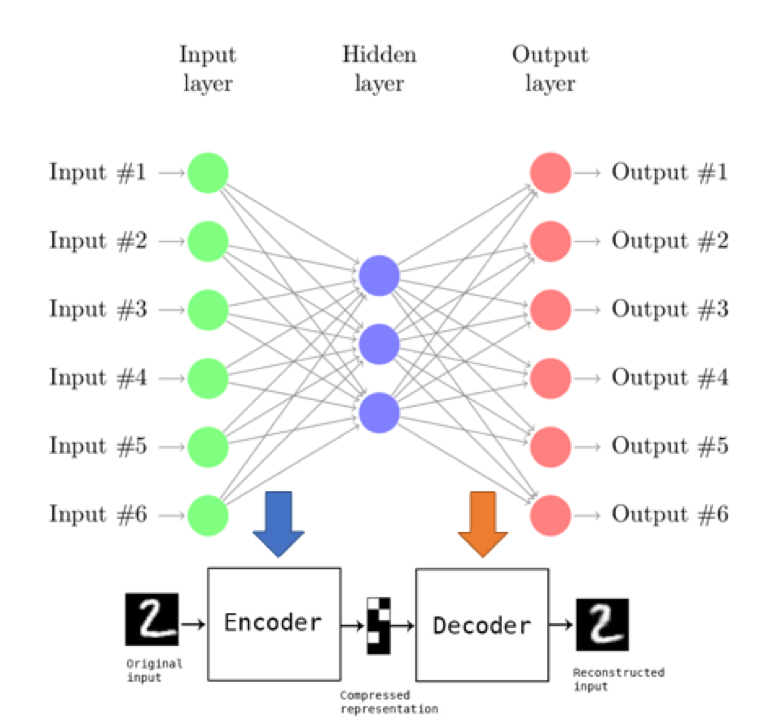

# Chap07.3 - 텐서플로 추상화와 간소화, Keras

 

## 7.4 케라스(Keras)

[**케라스(Keras)**](https://keras.io)는 인기있는 텐서플로 확장 라이브러리 중 하나이다. 케라스는 원래 Theano용으로 개발되었지만, 2017년 구글의 공식 후원을 받아 1.1버전 부터 `tf.contrib.keras`안에 들어왔으며, 현재 이글을 작성하는 시점인 2018.06.30의 1.8버전에는 `tf.keras`로 변경된 텐서플로의 한 부분으로 자리를 잡았다. 따라서, 케라스는 Theano와 텐서플로(TensorFlow) 양쪽을 모두 지원한다.

케라스는 연산 그래프를 다루고 텐서플로와 통신하는 데 사용할 수 있는 자체 그래프 구조를 가지고 있다. 케라스는 순차형([Sequential](https://keras.io/models/sequential))모델과 함수형 API([Funtional API](https://keras.io/models/model)) 두 가지 유형이 있다. 순차형 모델은 간단하게 계층을 쌓아 모델링 할 수 있도록 설계되었고, 함수형 API는 다양한 계층구조를 가진 일반적인 모델을 지원한다.

#### 설치

위에서도 말했듯이, 텐서플로 1.8 버전에서는 케라스를 `tf.keras`로 임포트할 수 있다. 하지만 텐서플로 1.1이전 버전인 경우 케라스를 사용하려면 별도로 설치를 해주어야 한다.

```bash
pip install numpy scipy yaml keras
```

여기서는 별도로 케라스를 설치하지 않고 텐서플로 안에 있는 `tf.keras`로 임포트하여 모델을 구현해본다.

 

### 7.4.1 순차형(Sequential) 모델

케라스의 순차형 모델은 정의한 다음 아래의 예제 코드처럼 차례로 계층(layer)을 쌓아 나가면 되는 매우 간단한 구조이다. 

#### 1) Sequential 모델 생성

```python
# example
from tensorflow.python.keras.models import Sequential
from tensorflow.python.keras.layers import Dense, Activation

model = Sequential()
model.add(Dense(units=64, input_dim=784))
model.add(Activation('softmax')
```

위의 코드는 다음과 같이 쓸 수도 있다.

```python
# example
model = Sequential([
    Dense(64, input_shape=(784,), activation='softmax')])
```

위의 코드에서 **Dense** 계층은 완전연결계층(fully-connected layer)을 의미한다. 

#### 2) Compilation

Sequential 모델을 정의하고 학습하기 전에 `.compile()` 메서드를 사용하여 학습에 대한 설정을 해줘야한다. 설정에 필요한 3개의 인자가 있는데 다음과 같다.

- **Optimizer**: 최적화 함수를 설정하는 부분이며, `'sgd', 'adam', 'rmsprop'` 등 문자열타입으로 설정할 수 있다.
- **Loss function**: 손실함수를 설정해주는 부분이며, `'categorical_crossentropy', 'mse'` 처럼 문자열타입으로 설정할 수 있다..
- **Metrics**: 모델의 성능을 판정하는데 사용하는 지표 함수이며,`['accuracy']` 처럼 리스트 형태로 설정한다.

```python
# example - compile
model.compile(optimizer='sgd',
              loss='categorical_crossentropy',
              metrics=['accuracy'])
```

위의 예제에서 `optimizer=` 인자에 `tf.keras.optimizers`를 사용하면 아래와 같이 더욱 정교한 최적화 함수를 설정할 수 있다.

```python
model.compile(optimizer=tf.keras.optimizers.SGD(lr=0.02, momentum=0.8, nesterov=True),
              loss='categorical_crossentropy',
              metrics=['accuracy'])
```

#### 3) Training

마지막으로 학습을 하기위해 `.fit()`에 학습할 데이터를 넣어주고, 에폭(`epochs`)과 배치크기(`batch_size`)를 설정해준다. [Chap07.1 - Estimator](http://excelsior-cjh.tistory.com/157)와 [Chapter07.2 - TFLearn](http://excelsior-cjh.tistory.com/158)에서 살펴본 `tf.estimator`와 `TFLearn`과 마찬가지로 모델에 대한 평가(`.evaluate()`) 및 예측(`.predict()`)을 제공한다.

```python
from tensorflow.python.keras.callbacks import TensorBoard, EarlyStopping

early_stop = EarlyStopping(monitor='val_loss', min_delta=0,
                           patience=10, verbose=0, mode='auto')
model.fit(x_train, y_train, epochs=10, batch_size=64,
          callbacks=[TensorBoard(log_dir='./models/autoencoder'),
                     early_stop])
```

위의 예제 코드에서 `.fit()`의 인자 중 `callbacks`는 학습 단계에서 적용되는 함수이며, 학습에 대한 통계를 구하거나, 동적으로 학습 결정을 할 수 있게 해주는 인자이다. 예제 코드에서는 `TensorBoard()` 함수와 `EarlyStopping()`을 콜백에 넣어주었다. `EarlyStopping()`은 **조기종료**로 해석할 수 있으며, 모델이 학습데이터에 완전히 적합되어 오버피팅 되는것을 방지할때 사용한다.

 

### 7.4.2 함수형 모델


함수형 모델은 먼저 입력과 출력을 정의한 뒤에 모델을 인스턴스화 해준다.

```python
# example
inputs= Input(shape=(784,))
x = Dense(64, activation='relu')(inputs)
x = Dense(32, activation='relu')(x)
outputs = Dense(10, activation='softmax')(x)
```

위에서처럼 먼저 입력과 출력을 정의한 후 모델을 인스턴스화 한다.

```python
# example
model = Model(inputs=inputs, outputs=outputs)
model.compile(optimizer='sgd',
              loss='categorical_crossentropy',
              metrics=['accuracy'])
```

 

### 7.4.3 케라스를 이용한 오토인코더 구현

오토인코더(AutoEncoder)는 아래의 그림과 같이 입력값과 출력값을 같게하는 신경망이다. 오토인코더는 Hidden layer의 노드갯수가 Input layer가 적게 구성되어 있기 때문에, 입력 데이터를 압축하는(차원을 축소하는) 효과가 있다.  



오토인코더는 학습된 데이터와 유사한 데이터에 가장 잘 적용되며, 주로 데이터의 저차원 표현 탐색, 데이터의 노이즈 제거, 데이터의 저차원으로의 시각화 등에 사용된다.

이번 에제코드는 CIFAR10 데이터에서 레이블 1에 해당하는 자동차 이미지에 노이즈를 추가한 후 이 데이터로 오토인코더를 학습한다.


```python
import numpy as np
import tensorflow as tf
from tensorflow.python.keras.models import Sequential
from tensorflow.python.keras.layers import Conv2D, MaxPooling2D, UpSampling2D
from tensorflow.python.keras.callbacks import TensorBoard, ModelCheckpoint

(x_train, y_train), (x_test, y_test) = tf.keras.datasets.cifar10.load_data()
x_train = x_train[np.where(y_train==1)[0],:,:,:]
x_test = x_test[np.where(y_test==1)[0],:,:,:]

# Normalization
x_train = x_train.astype('float32')/255.
x_test = x_test.astype('float32')/255.
```

 

CIFAR10 데이터에서 자동차에 해당하는 이미지를 불러온 후 아래와 같이 가우시안 노이즈를 추가한 데이터를 만들고 0보다 작거나 1보다 큰 값은 잘라낸다.


```python
x_train_n = x_train + 0.5 * np.random.normal(loc=0.0, scale=0.4, 
                                             size=x_train.shape)
x_test_n = x_test + 0.5 * np.random.normal(loc=0.0, scale=0.4,
                                           size=x_test.shape)
x_train_n = np.clip(x_train_n, 0., 1.)
x_test_n = np.clip(x_test, 0., 1.)
```

 

#### 1) Sequential을 이용한 모델 구성

케라스의 Sequential 모델을 이용해 오토인코더를 구성한다.


```python
model = Sequential()

# encoder
model.add(
    Conv2D(32, [3, 3], activation='relu', padding='same'))
model.add(
    MaxPooling2D([2, 2], padding='same'))
model.add(
    Conv2D(32, [3, 3], activation='relu', padding='same'))

# decoder
model.add(
    UpSampling2D([2, 2]))
model.add(
    Conv2D(3, [3, 3], activation='sigmoid', padding='same'))
```

 

#### 2) Compilation

모델을 학습하기전에 최적화함수 및 손실함수를 설정한다.


```python
model.compile(optimizer='adadelta', loss='binary_crossentropy')
```

 

#### 3) Training

`.fit()`에 입력 및 출력 데이터를 넣어주고, 에폭을 설정한다.


```python
# TensorBoard 시각화를 위한 설정
tensorboard = TensorBoard(log_dir='./logs/autoencoder', 
                          histogram_freq=0, write_graph=True, write_images=True)

# 학습된 모델을 저장하기 위한 설정
model_saver = ModelCheckpoint(filepath='./model/autoencoder/autoencoder_model', 
                              verbose=0, period=2)

# Training the network
model.fit(x_train_n, x_train, 
          epochs=10, batch_size=64, 
          shuffle=True, validation_data=(x_test_n, x_test), 
          callbacks=[tensorboard, model_saver])
```

    Train on 5000 samples, validate on 1000 samples
    Epoch 1/10
    5000/5000 [==============================] - 0s 85us/step - loss: 0.5633 - val_loss: 0.5496
    Epoch 2/10
    5000/5000 [==============================] - 0s 88us/step - loss: 0.5587 - val_loss: 0.5668
    Epoch 3/10
    5000/5000 [==============================] - 0s 76us/step - loss: 0.5542 - val_loss: 0.5427
    Epoch 4/10
    5000/5000 [==============================] - 0s 86us/step - loss: 0.5522 - val_loss: 0.5503
    Epoch 5/10
    5000/5000 [==============================] - 0s 82us/step - loss: 0.5496 - val_loss: 0.5391
    Epoch 6/10
    5000/5000 [==============================] - 0s 79us/step - loss: 0.5472 - val_loss: 0.5371
    Epoch 7/10
    5000/5000 [==============================] - 0s 80us/step - loss: 0.5467 - val_loss: 0.5474
    Epoch 8/10
    5000/5000 [==============================] - 0s 81us/step - loss: 0.5459 - val_loss: 0.5360
    Epoch 9/10
    5000/5000 [==============================] - 0s 81us/step - loss: 0.5449 - val_loss: 0.5436
    Epoch 10/10
    5000/5000 [==============================] - 0s 84us/step - loss: 0.5445 - val_loss: 0.5348


    <tensorflow.python.keras._impl.keras.callbacks.History at 0x7fef2008aeb8>


 

#### 4) matplotlib을 이용한 결과 시각화하기


```python
% matplotlib inline
import matplotlib.pyplot as plt

n_imgs = 10
f,axarr = plt.subplots(2, n_imgs,figsize=[20,5])
decoded_imgs = model.predict(x_test_n)

for i in range(n_imgs):
    
    ax = axarr[0,i]
    ax.get_yaxis().set_visible(False)
    ax.imshow(x_test_n[i,:,:,:])
    plt.gray()
    ax.get_xaxis().set_visible(False)
    ax.get_yaxis().set_visible(False)
    
    ax = axarr[1,i]
    ax.get_yaxis().set_visible(False)
    ax.imshow(decoded_imgs[i,:,:,:])
    plt.gray()
    ax.get_xaxis().set_visible(False)
    ax.get_yaxis().set_visible(False)
            
plt.tight_layout()
plt.show()
```


 

#### 5) 오토인토더 전체코드


```python
import numpy as np
import tensorflow as tf
from tensorflow.python.keras.models import Sequential
from tensorflow.python.keras.layers import Conv2D, MaxPooling2D, UpSampling2D
from tensorflow.python.keras.callbacks import TensorBoard, ModelCheckpoint

#########################
# 1) CIFAR10 data load
(x_train, y_train), (x_test, y_test) = tf.keras.datasets.cifar10.load_data()
x_train = x_train[np.where(y_train==1)[0],:,:,:]
x_test = x_test[np.where(y_test==1)[0],:,:,:]

# Normalization
x_train = x_train.astype('float32')/255.
x_test = x_test.astype('float32')/255.

###########################
# 2) Gaussian Noize 추가
x_train_n = x_train + 0.5 * np.random.normal(loc=0.0, scale=0.4, 
                                             size=x_train.shape)
x_test_n = x_test + 0.5 * np.random.normal(loc=0.0, scale=0.4,
                                           size=x_test.shape)
x_train_n = np.clip(x_train_n, 0., 1.)
x_test_n = np.clip(x_test, 0., 1.)

############################
# 3) Sequential 모델 구성
model = Sequential()

# encoder
model.add(
    Conv2D(32, [3, 3], activation='relu', padding='same'))
model.add(
    MaxPooling2D([2, 2], padding='same'))
model.add(
    Conv2D(32, [3, 3], activation='relu', padding='same'))

# decoder
model.add(
    UpSampling2D([2, 2]))
model.add(
    Conv2D(3, [3, 3], activation='sigmoid', padding='same'))

#############################
# 4) Compilation
model.compile(optimizer='adadelta', loss='binary_crossentropy')

#############################
# 5) Training
# TensorBoard 시각화를 위한 설정
tensorboard = TensorBoard(log_dir='./logs/autoencoder', 
                          histogram_freq=0, write_graph=True, write_images=True)

# 학습된 모델을 저장하기 위한 설정
model_saver = ModelCheckpoint(filepath='./model/autoencoder/autoencoder_model', 
                              verbose=0, period=2)

# Training the network
model.fit(x_train_n, x_train, 
          epochs=10, batch_size=64, 
          shuffle=True, validation_data=(x_test_n, x_test), 
          callbacks=[tensorboard, model_saver])
```

    Train on 5000 samples, validate on 1000 samples
    Epoch 1/10
    5000/5000 [==============================] - 1s 112us/step - loss: 0.6194 - val_loss: 0.5953
    Epoch 2/10
    5000/5000 [==============================] - 0s 81us/step - loss: 0.5704 - val_loss: 0.5638
    Epoch 3/10
    5000/5000 [==============================] - 0s 79us/step - loss: 0.5629 - val_loss: 0.5796
    Epoch 4/10
    5000/5000 [==============================] - 0s 81us/step - loss: 0.5580 - val_loss: 0.5485
    Epoch 5/10
    5000/5000 [==============================] - 0s 84us/step - loss: 0.5553 - val_loss: 0.5783
    Epoch 6/10
    5000/5000 [==============================] - 0s 80us/step - loss: 0.5525 - val_loss: 0.5427
    Epoch 7/10
    5000/5000 [==============================] - 0s 79us/step - loss: 0.5497 - val_loss: 0.5627
    Epoch 8/10
    5000/5000 [==============================] - 0s 81us/step - loss: 0.5488 - val_loss: 0.5394
    Epoch 9/10
    5000/5000 [==============================] - 0s 78us/step - loss: 0.5470 - val_loss: 0.5540
    Epoch 10/10
    5000/5000 [==============================] - 0s 84us/step - loss: 0.5461 - val_loss: 0.5377


    <tensorflow.python.keras._impl.keras.callbacks.History at 0x7fee989290f0>


 

### 7.4.4 정리

이번 포스팅에서는 케라스에 대해 살펴보았다. 케라스는 Sequential 모델과 함수형 API 두 가지 유형이 있는데, 사용하기에는 Sequential 모델이 좀더 편한것 같다. 케라스 홈페이지 https://keras.io/ 에서 더욱 자세한 케라스 사용법 및 튜토리얼을 확인할 수 있다.
