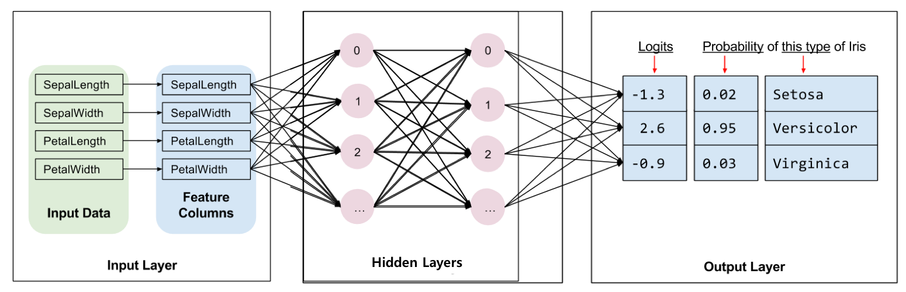
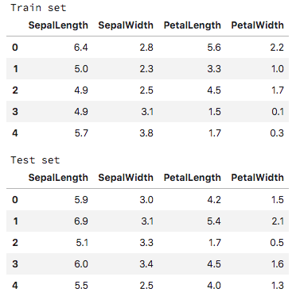

# Custom Estimator

df

> 이번 포스팅은 [TensorFlow:tm:>GUIDE](https://www.tensorflow.org/guide/custom_estimators#tensorboard)를 참고했으며, TensorFlow Estimator에 대한 자세한 내용은 [여기](http://excelsior-cjh.tistory.com/157?category=940399)를 참고하면 된다.

df

## 1. Estimator 란

`tf.estimator`은 Python의 대표적인 머신러닝 모듈인 [Scikit-Learn](http://scikit-learn.org/stable/index.html)(`sklearn`)의 스타일처럼 복잡한 딥러닝 모델을 쉽게 작성할 수 있도록 해주는 라이브러리다. Keras와 마찬가지로 [`tf.contrib.learn`](https://github.com/tensorflow/tensorflow/tree/r1.8/tensorflow/contrib/learn)으로 텐서플로에 들어왔으며, 이번 포스팅에서의 예제는 1.11.0버전(2018.09.28)에는 `tf.estimator`로 옮겨졌다.


## 2. Pre-made vs. Custom

아래의 그림에서 볼 수 있듯이, pre-made Estimator들은 [`tf.estimator.Estimator`](https://www.tensorflow.org/api_docs/python/tf/estimator/Estimator)의 하위 클래스(subclass)이며, custom Estimator는 `tf.estimator.Estimator`의 인스턴스(instance)이다. 


pre-made Estimator들은 `DNNClassifier`나 `LinearRegressor`처럼 모델이 미리 구현되어 있어 사용자가 빠르게 이를 이용할 수 있다는 장점이 있다. 하지만, [`CNN`](http://excelsior-cjh.tistory.com/152?category=940399)이나 [`RNN`](http://excelsior-cjh.tistory.com/156?category=940399) 등과 같은 모델은 미리 구현되어 있지 않기 때문에, 텐서플로의 Estimator를 사용해서 이러한 모델들을 학습시키기 위해서는 **custom Estimator**로 사용자가 직접 Estimator를 만들어 줘야 한다. 


### 2.1 model function

Estimator에서 **model function**(또는 `model_fn`)이 바로 ML/DL 알고리즘이 수행되는 함수이다. 즉, pre-made Estimator와 custom Estimator의 차이점은 다음과 같다.

- pre-made는 `model_fn`이 미리 구현 되어 있어, 별도의 프로그래밍 없이 바로 `train()/evaluate()/predict()`를 사용할 수 있다.
- 반면, custom Estimator는 `model_fn`이 구현되어 있지 않으므로, 반드시 `model_fn`에 **사용자가 직접 알고리즘을 구현해줘야 한다.**


model function에는 모든 종류의 hidden layer와 [metric](https://developers.google.com/machine-learning/glossary/#metric)을 가지고 다양한 ML/DL 알고리즘을 모델링 할 수 있으며, 텐서플로의 [Layers API](https://www.tensorflow.org/api_docs/python/tf/layers)와 [Metrics API](https://www.tensorflow.org/api_docs/python/tf/metrics)를 이용해 구현할 수 있다.


## 3. Custom Estimator 분류기 구현하기

위에서 살펴본 내용을 토대로 붓꽃 데이터(iris data)를 분류하는 Classifier를 단계별로 구현해 보자. 구현할 모델은 아래의 그림(출처:[TensorFlow.org](https://www.tensorflow.org/guide/premade_estimators)) 과 같이 2개의 hidden layer를 가지며, 각 hidden layer마다 10개의 노드(node)로 구성되어 있다.  




### 3.1 Input function 구현하기

#### 3.1.1 Iris Data Load

먼저, 모델링할 붓꽃 데이터셋(iris dataset)을 다운 받는 코드를 작성해야 한다. 아래의 코드는 TensorFlow의 튜토리얼 [`iris_data.py`](https://github.com/tensorflow/models/blob/master/samples/core/get_started/iris_data.py) 코드를 참고한 것이다.

```python
import pandas as pd
import tensorflow as tf

# https://github.com/tensorflow/models/blob/master/samples/core/get_started/iris_data.py

TRAIN_URL = "http://download.tensorflow.org/data/iris_training.csv"
TEST_URL = "http://download.tensorflow.org/data/iris_test.csv"

CSV_COLUMN_NAMES = ['SepalLength', 'SepalWidth',
                    'PetalLength', 'PetalWidth', 'Species']
SPECIES = ['Setosa', 'Versicolor', 'Virginica']

def maybe_download():
    train_path = tf.keras.utils.get_file(TRAIN_URL.split('/')[-1], TRAIN_URL)
    test_path = tf.keras.utils.get_file(TEST_URL.split('/')[-1], TEST_URL)

    return train_path, test_path

def load_data(y_name='Species'):
    """Returns the iris dataset as (train_x, train_y), (test_x, test_y)."""
    train_path, test_path = maybe_download()
    
    train = pd.read_csv(train_path, names=CSV_COLUMN_NAMES, header=0)
    train_x, train_y = train, train.pop(y_name)
    
    test = pd.read_csv(test_path, names=CSV_COLUMN_NAMES, header=0)
    test_x, test_y = test, test.pop(y_name)
    
    # run in jupyter notebook
    display(train.head(5))
    display(test.head(5))
    
    return (train_x, train_y), (test_x, test_y)


(train_x, train_y), (test_x, test_y) = load_data()
```




#### 3.1.2 Input function

구현한 Estimator에 training(학습), evaluating(검증), prediction(예측)을 위한 데이터를 제공해주기 위해서는 아래와 같이 **input_function**을 반드시 구현해야 한다. input function에 대한 자세한 내용은 [여기](https://www.tensorflow.org/guide/premade_estimators)서 확인할 수 있다.

```python
def train_input_fn(features, labels, batch_size):
    """An input function for training"""
    # Convert the inputs to a Dataset.
    dataset = tf.data.Dataset.from_tensor_slices((dict(features), labels))
    
    # Shuffle, repeat, and batch the examples.
    dataset = data.shuffle(1000).repeat().batch(batch_size)
    
    # Return the read end of the pipeline
    return dataset.make_one_shot_iterator().get_next()
```


### 3.2 Feature Column 생성하기

Estimator를 이용해 모델을 만들 때는 학습시킬 데이터 특성(feature)들의 유형을 명시해줘야 한다. 텐서플로의 `tf.feature_column`을 이용해 각 특성들의 유형을 정의해줄 수 있으며, 이에 대한 자세한 내용은 [여기](http://excelsior-cjh.tistory.com/175) 참고하면 된다. 이번에 구현할 붓꽃(iris) 데이터의 각 특성들 `['SepalLength', 'SepalWidth', 'PetalLength', 'PetalWidth']` 은 수치형(numeric) 데이터이므로 아래와 같이 `tf.feature_column.numeric_column`을 사용한다.

```python
feature_columns = []
for key in train_x.keys():
    feature_columns.append(tf.feature_column.numeric_column(key=key))
    
feature_columns

""" 출력결과
[_NumericColumn(key='SepalLength', shape=(1,), default_value=None, dtype=tf.float32, normalizer_fn=None),
 _NumericColumn(key='SepalWidth', shape=(1,), default_value=None, dtype=tf.float32, normalizer_fn=None),
 _NumericColumn(key='PetalLength', shape=(1,), default_value=None, dtype=tf.float32, normalizer_fn=None),
 _NumericColumn(key='PetalWidth', shape=(1,), default_value=None, dtype=tf.float32, normalizer_fn=None)]
"""
```


### 3.3 Model function 구현하기

이제, Custom Estimator에서 ML/DL 알고리즘이 수행되는 함수인 **model function**을 구현해보자. model function은 아래와 같이 구성되며, 각 인자들을 살펴보면 다음과 같다.

```python
def model_fn(
    features, # This is batch_features from input_fn
    labels,   # This is batch_labels from input_fn
    mode,     # An instance of tf.estimator.ModeKeys
    params):  # Additional configuration 
```


- `features`: input function에서 반환된 `batch_size`만큼의 입력 데이터 즉, 특성값들(features).
- `labels`: input function에서 반환된 `batch_size`만큼의 레이블(label).
- `mode`: [`tf.estimator.ModeKeys`](https://www.tensorflow.org/api_docs/python/tf/estimator/ModeKeys)의 인스턴스 값
  - `TRAIN`: training mode
  - `EVAL`: evaluation mode
  - `PREDICT`: inference mode
- `params`: 추가적인 구성요소이며, 딕셔너리 형태로 만들어 줌


위의 형식을 토대로 붓꽃 데이터 분류기에 대한 model function을 아래와 같이 작성할 수 있다.

```python
def model_fn(features, labels, mode, params):
    
    # input layer
    net = tf.feature_column.input_layer(features, params['feature_columns'])
    
    # hidden layer
    for units in params['hidden_units']:
        net = tf.layers.dense(net, units=units, activation=tf.nn.relu)
        
    # output layer(logits)
    logits = tf.layers.dense(net, units=params['n_classes'], activation=None)
    
    # prediction
    predicted_class = tf.argmax(logits, 1)
    
    # loss
    loss = tf.losses.sparse_softmax_cross_entropy(labels=labels, logits=logits)
    
    # evaluation metrics
    accuracy = tf.metrics.accuracy(labels=labels,
                                   predictions=predicted_class, 
                                   name='acc_op')
    metrics = {'accuracy': accuracy}
    tf.summary.scalar('accuracy', accuracy[1])
    
    # TRAIN Mode
    if mode == tf.estimator.ModeKeys.TRAIN:
        optimizer = tf.train.AdamOptimizer(learning_rate=params['learning_rate'])
        train_op = optimizer.minimize(loss, global_step=tf.train.get_global_step())
        return tf.estimator.EstimatorSpec(mode, loss=loss, train_op=train_op)
    
    # EVAL Mode
    if mode == tf.estimator.ModeKeys.EVAL:
        return tf.estimator.EstimatorSpec(mode, loss=loss, eval_metric_ops=metrics)
    
    # PREDICT Mode
    if mode == tf.estimator.ModeKeys.PREDICT:
        predictions = {
            'class_ids': predited_class[:, tf.newaxis],
            'probabilities': tf.nn.softmax(logits),
            'logits': logits,
        }
        return tf.estimator.EstimatorSpec(mode, predictions=predictions)
```


### 3.4 Estimator 생성하기

3.3 에서 구현한 `model_fn`을 이용해 아래의 코드와 같이 Estimator를 생성해준다.

```python
classifier = tf.estimator.Estimator(
    model_fn=model_fn,
    # Directory to save model parameters, graph and etc.
    model_dir='./model',
    params={
        'feature_columns': feature_columns,
        # 2 hidden layers of 10 nodes each.
        'hidden_units': [10, 10],
        # ouput layers units
        'n_classes': 3,
        # learning rate
        'learning_rate': 0.001,
    })

""" 실행결과
INFO:tensorflow:Using default config.
INFO:tensorflow:Using config: {'_model_dir': './model', '_tf_random_seed': None, '_save_summary_steps': 100, '_save_checkpoints_steps': None, '_save_checkpoints_secs': 600, '_session_config': allow_soft_placement: true
graph_options {
  rewrite_options {
    meta_optimizer_iterations: ONE
  }
}
, '_keep_checkpoint_max': 5, '_keep_checkpoint_every_n_hours': 10000, '_log_step_count_steps': 100, '_train_distribute': None, '_device_fn': None, '_protocol': None, '_eval_distribute': None, '_experimental_distribute': None, '_service': None, '_cluster_spec': <tensorflow.python.training.server_lib.ClusterSpec object at 0x10b7f4630>, '_task_type': 'worker', '_task_id': 0, '_global_id_in_cluster': 0, '_master': '', '_evaluation_master': '', '_is_chief': True, '_num_ps_replicas': 0, '_num_worker_replicas': 1}
"""
```


### 3.5 Model Train/Evaluate/Prediction 하기

3.4에서 생성한 Estimator를 이용해 Training, Evaluating, Prediction을 수행해보자. 이 단계에서 3.1에서 구현한 input function(`input_fn`)이 사용된다.


#### 3.5.1 Training

먼저, Estimator의 `train()`을 이용해 모델을 학습시켜 보자. `train()`의 인자로는 다음과 같다.

- `input_fn`: 3.1에서 구현한 `train_input_fn`
- `step`: 학습시킬 횟수이며, epoch이 아닌 batch_size당 학습을 1회로 카운팅한다.


```python
# set batch size
BATCH_SIZE = 32
# set train steps
NUM_STEPS = 1000

# Train the Model.
classifier.train(
    input_fn=lambda: train_input_fn(train_x, train_y, BATCH_SIZE), 
    steps=NUM_STEPS )

"""실행결과
INFO:tensorflow:Calling model_fn.
INFO:tensorflow:Done calling model_fn.
INFO:tensorflow:Create CheckpointSaverHook.
INFO:tensorflow:Graph was finalized.
INFO:tensorflow:Restoring parameters from ./model/model.ckpt-2200
INFO:tensorflow:Running local_init_op.
INFO:tensorflow:Done running local_init_op.
INFO:tensorflow:Saving checkpoints for 2200 into ./model/model.ckpt.
INFO:tensorflow:loss = 0.02951492, step = 2201
INFO:tensorflow:global_step/sec: 631.405
INFO:tensorflow:loss = 0.09364262, step = 2301 (0.160 sec)
INFO:tensorflow:global_step/sec: 934.046
INFO:tensorflow:loss = 0.047696367, step = 2401 (0.107 sec)
INFO:tensorflow:global_step/sec: 904.74
INFO:tensorflow:loss = 0.05123502, step = 2501 (0.110 sec)
INFO:tensorflow:global_step/sec: 1044.97
INFO:tensorflow:loss = 0.05599692, step = 2601 (0.096 sec)
INFO:tensorflow:global_step/sec: 1043.84
INFO:tensorflow:loss = 0.04740165, step = 2701 (0.096 sec)
INFO:tensorflow:global_step/sec: 1156.53
INFO:tensorflow:loss = 0.020345824, step = 2801 (0.086 sec)
INFO:tensorflow:global_step/sec: 999.689
INFO:tensorflow:loss = 0.033384256, step = 2901 (0.100 sec)
INFO:tensorflow:global_step/sec: 1154.9
INFO:tensorflow:loss = 0.032274324, step = 3001 (0.086 sec)
INFO:tensorflow:global_step/sec: 1101.7
INFO:tensorflow:loss = 0.020915302, step = 3101 (0.090 sec)
INFO:tensorflow:Saving checkpoints for 3200 into ./model/model.ckpt.
INFO:tensorflow:Loss for final step: 0.048767257.
"""
```


#### 3.5.2 Evaluation

3.5.1에서 학습시킨 모델을 Estimator의 `evaluate()`를 이용해 검증해보도록 하자.

```python
# set batch size
BATCH_SIZE = 32

# Evaluate the Model.
eval_result = classifier.evaluate(
    input_fn=lambda: eval_input_fn(test_x, test_y, BATCH_SIZE))

print('#'*50)
print('eval_result :', eval_result)

"""출력결과
INFO:tensorflow:Calling model_fn.
INFO:tensorflow:Done calling model_fn.
INFO:tensorflow:Starting evaluation at 2018-09-29-02:17:22
INFO:tensorflow:Graph was finalized.
INFO:tensorflow:Restoring parameters from ./model/model.ckpt-3200
INFO:tensorflow:Running local_init_op.
INFO:tensorflow:Done running local_init_op.
INFO:tensorflow:Finished evaluation at 2018-09-29-02:17:22
INFO:tensorflow:Saving dict for global step 3200: accuracy = 0.93333334, global_step = 3200, loss = 0.063818015
INFO:tensorflow:Saving 'checkpoint_path' summary for global step 3200: ./model/model.ckpt-3200
##################################################
eval_result : {'accuracy': 0.93333334, 'loss': 0.063818015, 'global_step': 3200}
"""
```


#### 3.5.3 Prediction

이번에는 가상의 붓꽃 데이터를 만들어, 이 데이터에 대해 학습한 모델을 이용하여 예측을 해보도록 하자.

```python
# Generate data
SPECIES = ['Setosa', 'Versicolor', 'Virginica']
predict_x = {
    'SepalLength': [5.1, 5.9, 6.9],
    'SepalWidth': [3.3, 3.0, 3.1],
    'PetalLength': [1.7, 4.2, 5.4],
    'PetalWidth': [0.5, 1.5, 2.1],
}

# Predict the data
predictions = classifier.predict(
    input_fn=lambda: eval_input_fn(predict_x, labels=None, batch_size=3))

for pred_dict, expec in zip(predictions, SPECIES):
    template = ('\nPrediction is "{}" ({:.1f}%), expected "{}"')
    
    class_id = pred_dict['class_ids'][0]
    probability = pred_dict['probabilities'][class_id]
    
    print(template.format(expected[class_id], 
                          100* probability, expec))
    
'''출력결과
Prediction is "Setosa" (99.7%), expected "Setosa"

Prediction is "Versicolor" (99.7%), expected "Versicolor"

Prediction is "Virginica" (98.4%), expected "Virginica"
'''
```


## 4. 마무리

이번 포스팅에서는 텐서플로의 Estimator 중 Custom Estimator에 대해 알아 보았다. 위의 코드에 대해서는 https://github.com/ExcelsiorCJH/LearningTensorFlow/blob/master/Chap12-Custom_Estimator/Chap12-Custom_Estimator.ipynb 에서 확인할 수 있다.

