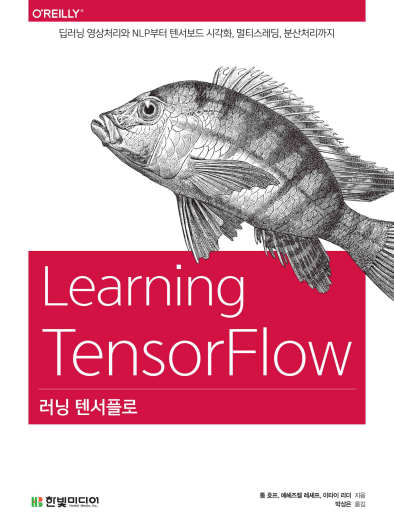

# Learning TensorFlow

## 1. 교재

### 러닝 텐서플로(Learning TensorFlow)

## 2. 목차

아래의 링크를 클릭하면 [nbviewer.jupyter.org](nbviewer.jupyter.org)에서 열림

- Chap01 - [개요](http://excelsior-cjh.tistory.com/148?category=940399)
- Chap02 - [텐서플로 설치에서 실행까지](http://nbviewer.jupyter.org/github/ExcelsiorCJH/LearningTensorFlow/blob/master/Chap02-Up_and_Running/Chap02-Up_and_Running.ipynb)
- Chap03 - [텐서플로의 기본 이해하기](http://nbviewer.jupyter.org/github/ExcelsiorCJH/LearningTensorFlow/blob/master/Chap03-TensorFlow_Basics/Chap03-TensorFlow_Basics.ipynb)
- Chap04 - [합성곱 신경망](http://nbviewer.jupyter.org/github/ExcelsiorCJH/LearningTensorFlow/blob/master/Chap04-Convolutional_Neural_Networks/Chap04-CNN.ipynb)

- Chap05 - [텍스트 1: 텍스트와 시퀀스 처리 및 텐서보드 시각화](https://github.com/ExcelsiorCJH/LearningTensorFlow/blob/master/Chap05-Text_and_Visualizations/Chap05-Text_and_Visualizations.ipynb)

- Chap06 - [텍스트 2: 단어 벡터, 고급 RNN, 임베딩 시각화](https://github.com/ExcelsiorCJH/LearningTensorFlow/blob/master/Chap06-Word_Embeddings_and_RNNs/Chap06-Word_Embeddings_and_RNNs.ipynb)

- Chap07 - 텐서플로 추상화와 간소화
    - 7.1 - [Estimator](https://github.com/ExcelsiorCJH/LearningTensorFlow/blob/master/Chap07-TF_Abstractions/Chap07_1-TF_Estimator.ipynb)
    - 7.2 - [TFLearn](https://github.com/ExcelsiorCJH/LearningTensorFlow/blob/master/Chap07-TF_Abstractions/Chap07_2-TFLearn.ipynb)
    - 7.3 - [Keras](https://github.com/ExcelsiorCJH/LearningTensorFlow/blob/master/Chap07-TF_Abstractions/Chap07_3-Keras.ipynb)
    - 7.4 - [TF-Slim](https://github.com/ExcelsiorCJH/LearningTensorFlow/blob/master/Chap07-TF_Abstractions/Chap07_4-TF_Slim.ipynb)
    
- Chap08 - [큐, 스레드, 데이터 읽기](https://github.com/ExcelsiorCJH/LearningTensorFlow/blob/master/Chap08-DataRead_and_TFRecord/Chap08-DataRead_and_TFRecord.ipynb)

- Chap09 - [분산 텐서플로](https://github.com/ExcelsiorCJH/LearningTensorFlow/blob/master/Chap09-Distributed_TensorFlow/Chap09-Distributed_TensorFlow.ipynb)

- Chap10 - 모델 엑스포트와 서빙
    - 10.1 - [TensorFlow Saver](https://github.com/ExcelsiorCJH/LearningTensorFlow/blob/master/Chap10-Exporting_and_Serving_Model/Chap10-1_TF_Saver.ipynb)
    - 10.2 - [TensorFlow Serving](https://github.com/ExcelsiorCJH/LearningTensorFlow/blob/master/Chap10-Exporting_and_Serving_Model/Chap10-2_TF_Serving.ipynb)

#### [Chap11 ~]는공부 후 추가 (교재에 없는 내용) 
- Chap11 - [TensorFlow Feature Column](https://github.com/ExcelsiorCJH/LearningTensorFlow/blob/master/Chap11-Feature%20Columns/Chap11-Feature_Column.ipynb)

## 3. 참고자료

- GitHub : https://github.com/Hezi-Resheff/Oreilly-Learning-TensorFlow
- TensorFlow docs : https://www.tensorflow.org/api_docs/

